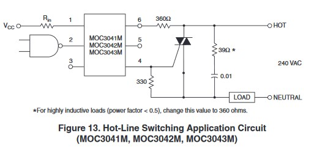
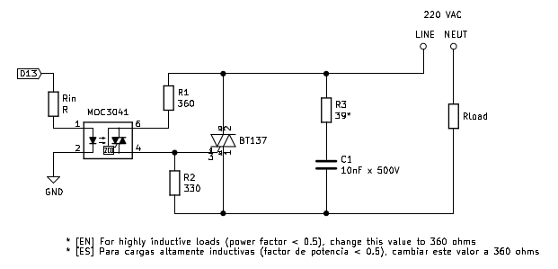

# SSR

## Componentes a utilizar

- Triac:
  - BT137-600E
- Optoacoplador:
  - MOC3041
- Resistencias:
  - 39  ohms
  - 330 ohms
  - 360 ohms
- Capacitor:
  - 10nF x500V (cerámico)

## Schematics

## Referencias

1. [Idea][1]
2. [Datasheet MOC3041M, circuito de aplicación][2]

[1]: <https://www.instructables.com/id/DIY-Solid-State-Relay-1/>
[2]: <https://pdf1.alldatasheet.com/datasheet-pdf/view/53867/FAIRCHILD/MOC3041M.html>